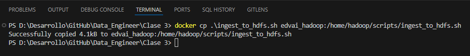
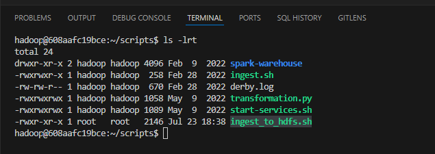
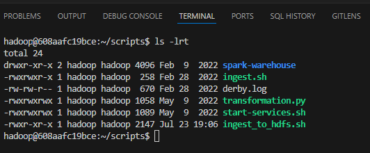
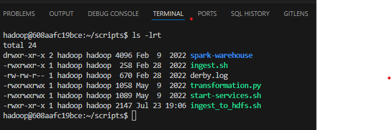
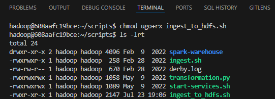
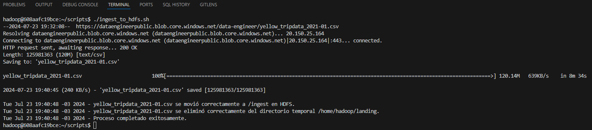
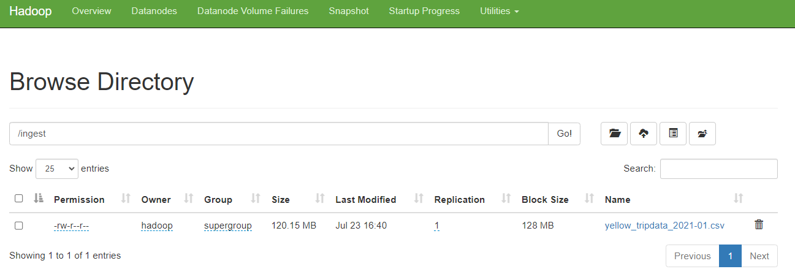
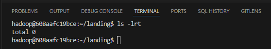

## Notas  de la clase 3

Bajar la imagen Docker de Hadoop: 
* docker pull fedepineyro/edvai_ubuntu:v6

Correr el contenedor: 
* docker run --name edvai_hadoop -p 8081:8081 -p 8080:8080 -p 8088:8088 -p 8889:8889 -p 9870:9870 -p 9868:9868 -p 9864:9864 -p 1527:1527 -p 10000:10000 -p 10002:10002 -p 8010:8010 -p 9093:9093 -p 2181:2182 -it  --restart unless-stopped fedepineyro/edvai_ubuntu:v6 /bin/bash -c "/home/hadoop/scripts/start-services.sh"

Una vez que corrió debería correr cada vez que abran Docker, de todas maneras si no levanta lo pueden levantar con el siguiente comando: 
* docker start edvai_hadoop

ingresar al shell del contenedor de hadoop: 
* docker exec -it edvai_hadoop bash

Siempre trabajen con el usuario hadoop: 
* su hadoop

### Para la parte de ingest:
Bajar un archivo al sistema operativo que se utiliza (Ubuntu): 
* wget -P /home/hadoop/landing  https://dataengineerpublic.blob.core.windows.net/data-engineer/yellow_tripdata_2021-01.csv

copiar el archivo a HDFS: 
* hdfs dfs -put /home/hadoop/landing/yellow_tripdata_2021-01.csv /ingest

### Como tarea les queda:
* Levantar el contenedor de Hadoop
* Crear un script de shell que corra el ingest automáticamente

# Ejercicio 
Creamos el archivo (ingest_to_hdfs) en nuestro VC de manera local y posterior los copiamos a nuestro contendor Docker(edvai_hadoop)
* docker cp .\ingest_to_hdfs.sh edvai_hadoop:/home/hadoop/scripts/ingest_to_hdfs.sh

Verificamos que si lo copio de manera correcta 

Abrimos el archivo para corroborar
* cat ingest_to_hdfs

Cambiamos los permisos para que el script se pueda ejecutar con el usuario Hadoop
* chown root:hadoop /home/hadoop/scripts/ingest_to_hdfs.sh
* chown hadoop:hadoop /home/hadoop/scripts/ingest_to_hdfs.sh

Permisos de lectura y escritura
* chmod ugo+rx ingest_to_hdfs.sh 

Ejecutamos el archivo para validar su funcionalidad.
* ./ingest_to_hdfs.sh

validamos en UI - Hadoop

confirmamos que ya no exista el archivo en la carpeta landing
