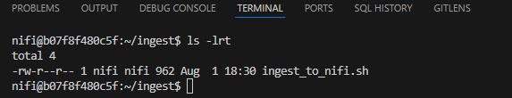
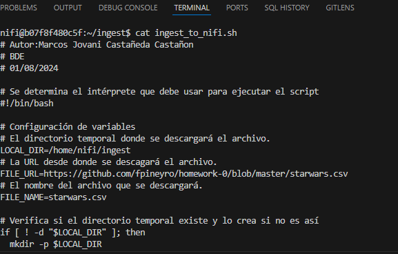
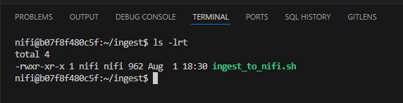
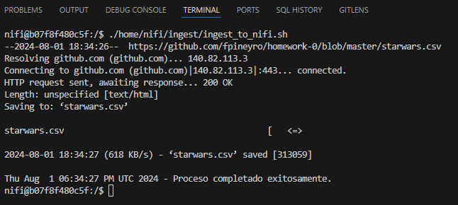
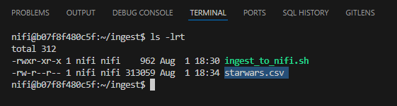
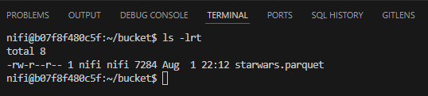
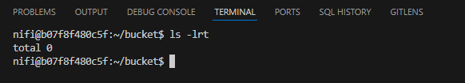
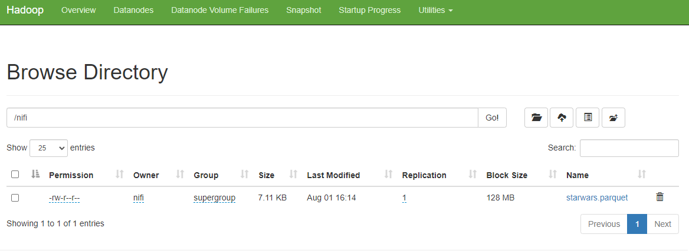
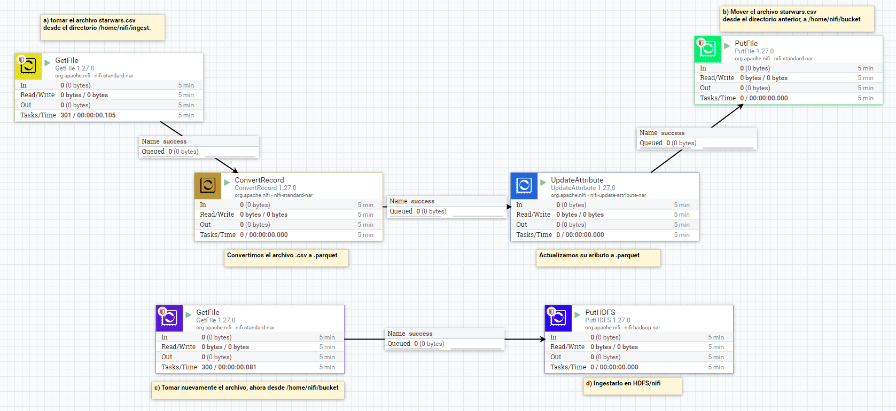

## 1) En el shell de Nifi, crear un script .sh que descargue el archivo starwars.csv al directorio /home/nifi/ingest (crearlo si es necesario). Ejecutarlo con ./home/nifi/ingest/ingest.sh

Creamos el archivo (**ingest_to_nifi**) en nuestro contendor Docker(**nifi**)
~~~
cat > ingest_to_nifi.sh
~~~

Abrimos el archivo para corroborar
~~~
cat ingest_to_nifi
~~~

Asignamos permisos de lectura y ejecución (user-group-other) + (read-execute)
~~~
chmod ugo+rx ingest_to_nifi.sh
~~~

Ejecutamos el archivo para validar su funcionalidad.
~~~
./home/nifi/ingest/ingest_to_nifi.sh
~~~

Validamos que se encuentre en la carpeta destino.

## 2) Usando procesos en Nifi:
#### a) tomar el archivo starwars.csv desde el directorio /home/nifi/ingest.
#### b) Mover el archivo starwars.csv desde el directorio anterior, a /home/nifi/bucket(crear el directorio si es necesario)

#### c) Tomar nuevamente el archivo, ahora desde /home/nifi/bucket

#### d) Ingestarlo en HDFS/nifi (si es necesario, crear el directorio con hdfs dfs -mkdir /nifi )

Mostramos el flujo creado en NIFI

