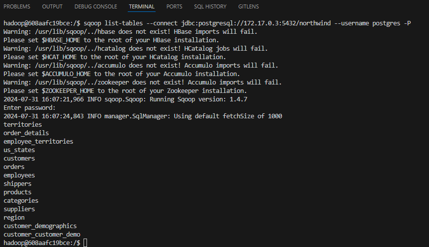
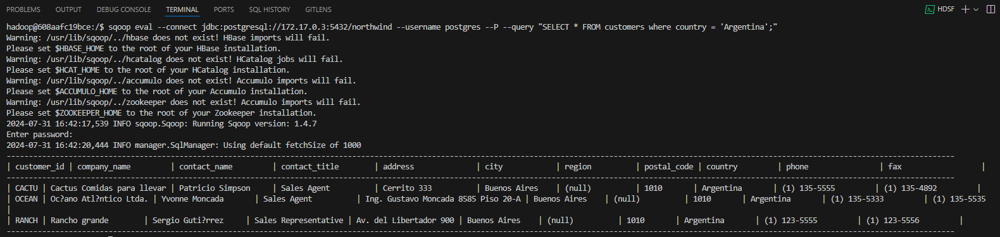
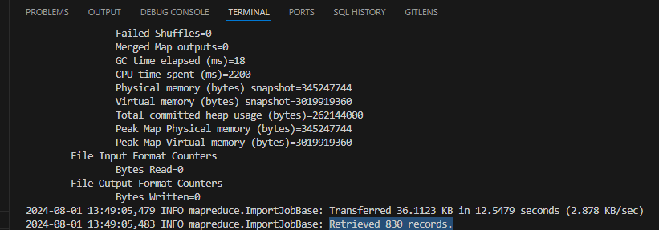
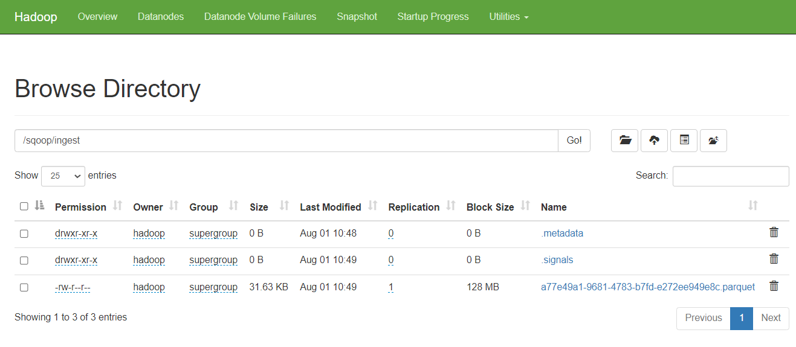
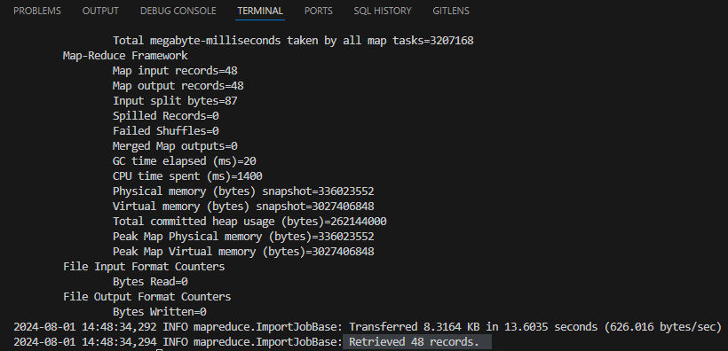
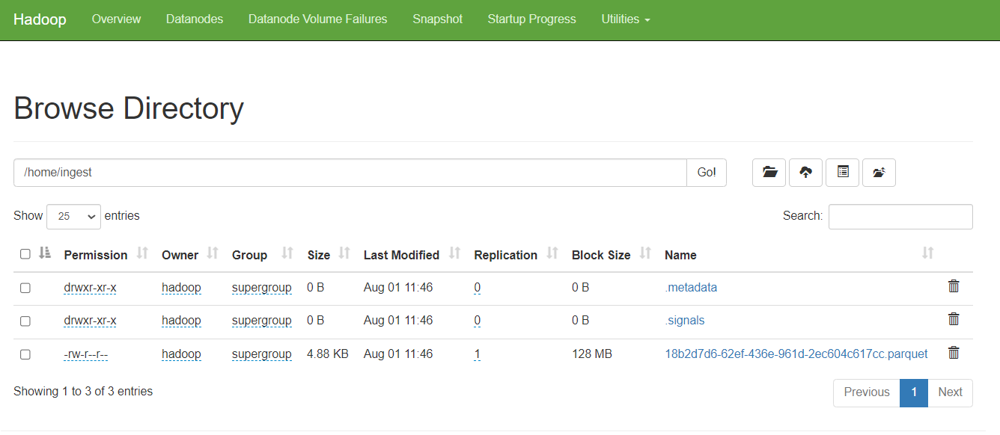

## Practica Sqoop

Atención: por defecto, el puerto de postgres es 5432, pero puede variar de acuerdo a la
configuración hecha.
Para comprobar el puerto de postgres, ejecutar docker inspect edvai_postgres y verificar el
puerto, otra manera es ingresar al container de Docker de postgres **(docker exec -it
edvai_postgres bash)**. 

En el file /var/lib/postgresql/pgdata/postgresql.conf está definido el
puerto.
Verificar también que el container de Docker de postgres esté ejecutándose.

## Comandos:

Listar databases:
~~~
sqoop list-databases \
--connect jdbc:postgresql://172.17.0.3:5432/northwind \
--username postgres -P
~~~
Listar tablas:
~~~
sqoop list-tables \
--connect jdbc:postgresql://172.17.0.3:5432/northwind \
--username postgres -P
~~~
Ejecutar queries
~~~
sqoop eval \
--connect jdbc:postgresql://172.17.0.3:5432/northwind \
--username postgres \
--P \
--query "select * from region limit 10"
~~~
Importar tablas:
~~~
sqoop import \
--connect jdbc:postgresql://172.17.0.3:5432/northwind \
--username postgres\
--table region\
--m 1 \
--P \
--target-dir /sqoop/ingest \
--as-parquetfile \
--delete-target-dir
~~~
Importar tablas con filtro:
~~~
sqoop import \
--connect jdbc:postgresql://172.17.0.3:5432/northwind \
--username postgres\
--table region\
--m 1 \
--P \
--target-dir /sqoop/ingest/southern \
--as-parquetfile \
--where "region_description = 'Southern' " \
--delete-target-dir
~~~
## Ejercicio
### 1) Mostrar las tablas de la base de datos northwind
~~~
sqoop list-tables \
--connect jdbc:postgresql://172.17.0.3:5432/northwind \
--username postgres -P
~~~

### 2) Mostrar los clientes de Argentina
~~~
sqoop eval \
--connect jdbc:postgresql://172.17.0.3:5432/northwind \
--username postgres \
--P \
--query "SELECT * FROM customers where country = 'Argentina';"
~~~

### 3) Importar un archivo .parquet que contenga toda la tabla orders. Luego ingestar el archivo a HDFS (carpeta /sqoop/ingest)
~~~
sqoop import \
--connect jdbc:postgresql://172.17.0.3:5432/northwind \
--username postgres \
--table orders \
--m 1 \
--P \
--target-dir /sqoop/ingest \
--as-parquetfile \
--delete-target-dir
~~~
Importamos 830 registros de la tabla orders.

Validamos que se haya realizado el ingest a HDFS.

### 4) Importar un archivo .parquet que contenga solo los productos con mas 20 unidades en stock, de la tabla Products . Luego ingestar el archivo a HDFS (carpeta ingest).
~~~
sqoop import \
--connect jdbc:postgresql://172.17.0.3:5432/northwind \
--username postgres \
--query "select * from products where units_in_stock > 20 AND \$CONDITIONS" \
--m 1 \
--P \
--target-dir /home/ingest \
--as-parquetfile \
--delete-target-dir
~~~
Importamos 48 registros.

Validamos que se haya realizado el ingest a HDFS.

