# Practica ingest GCP

### 1. Crear un Bucket Regional standard en Finlandia llamado *demo-bucket-edvai-bde*

* Creamos un bucket desde la interfaz de GCP 

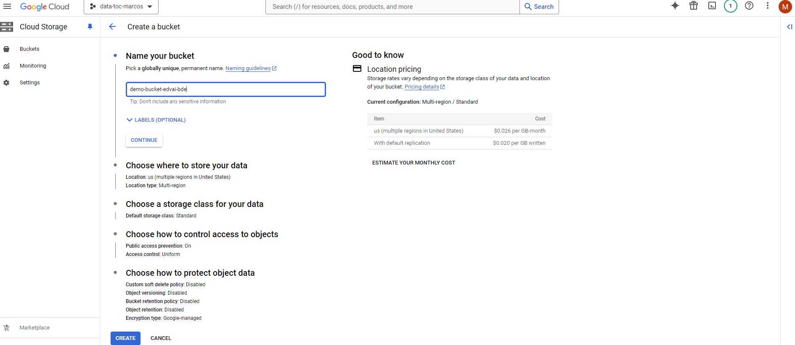

* Mostramos que ya se haya creado

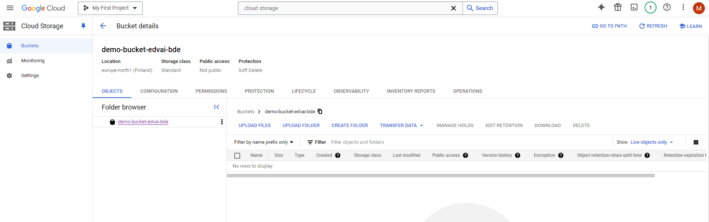

### 2. Crear un bucket multiregional standard en US llamado *data-bucket-demo-bde*

* Creamos un bucket desde la interfaz de GCP

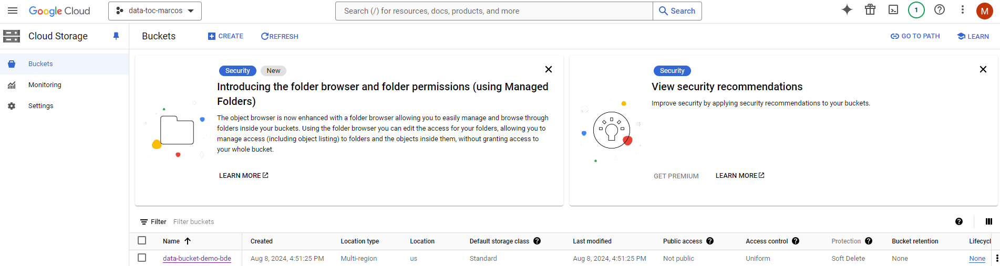

### 3. Hacer ingest con la herramienta CLI Gsutil de 5 archivos csv en el bucket *data-bucket-demo-bde*

* Vamos a ingestar los 5 archivos con extensión .csv

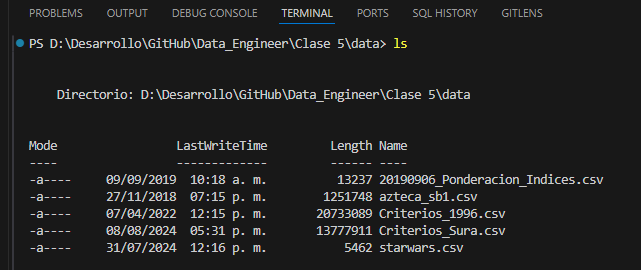

* Validamos la dirección del bucket destino 

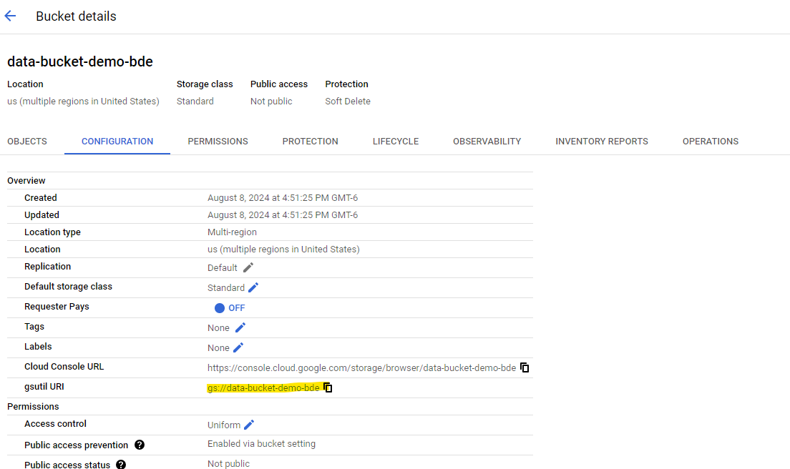

~~~
Realizamos el ingest con el comando gsutil cp **nombre_archivo** destino_bucket  
~~~

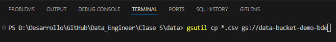

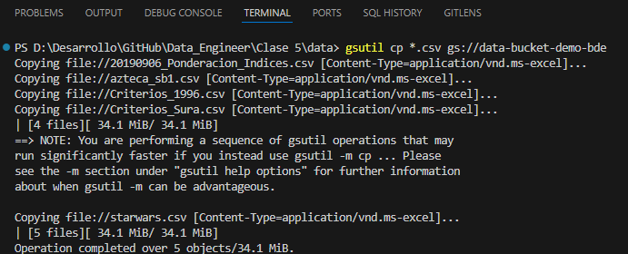

* Validamos que se haya realizado el ingest correctamente.

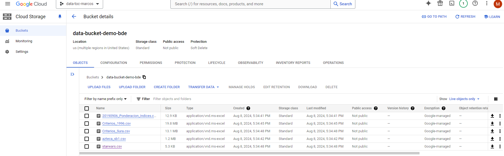

### 4. Utilizar el servicio de storage transfer para crear un job que copie los archivos que se encuentran en *data-bucket-demo-bde* a *demo-bucket-edvai-edvai*

* Creamos un transferjob 

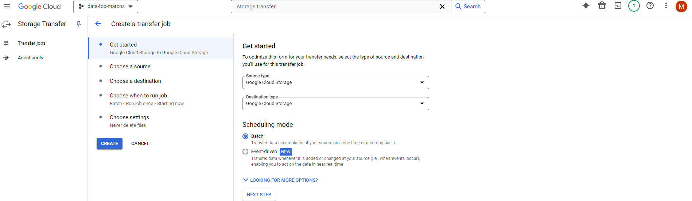

* Seleccionamos desde donde vamos a tomar los archivos.

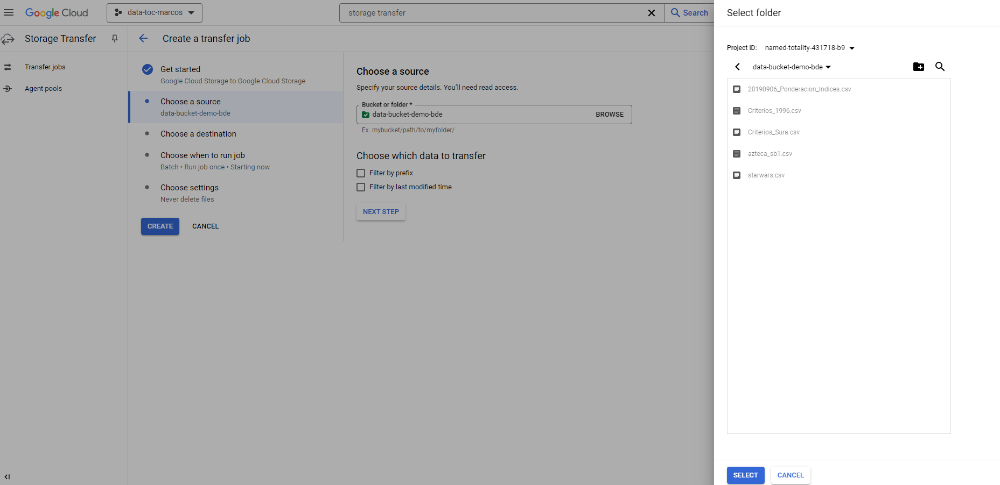

* Seleccionamos la carpeta de destino.

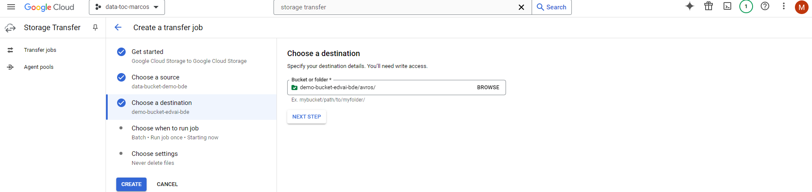

* ¿Cuando queremos que se corra el job?

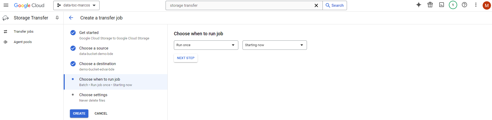

* Validamos la creación del job.

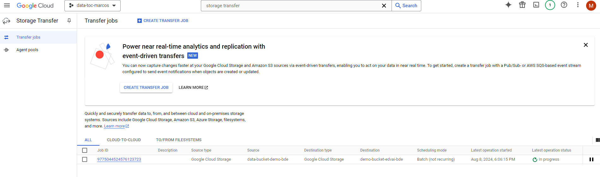

* Validamos que se haya corrido sin ningun problema.

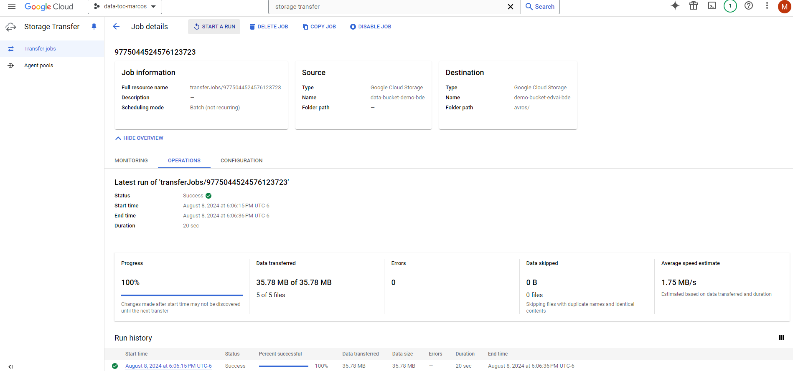

* Checamos la carpeta destino para visualizar los archivos.

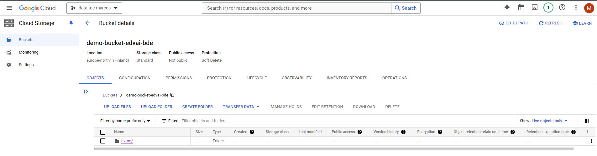

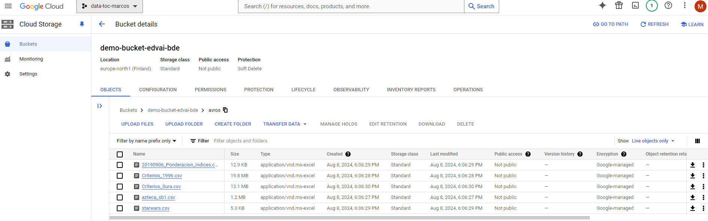