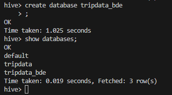

## Notas de la clase 6
* Una de las mejores practicas es que si empiezas a trabajar con SQL desde el inicio, terminar todo el pipeline con SQL.
* No mezclar SQL - Scala - Pyspark
* Se deben crear pipelines en cada lenguaje identificado.
* **DATAWAREHOUSE**: Es un depósito central de información que se puede analizar para tomar decisiones más informadas. Los datos fluyen hacia un almacén de datos desde sistemas transaccionales,bases de datos relacionales y otras fuentes, normalmente con una cadencia regular.

 

* Creamos tablas **INTERNAS** en HIVE cuando nadie va acceder de afuera.
* Creamos tablas **EXTERNAS** cuando depositan archivos sobre HDFS, solo se crea la metada.

 ### Puntos relevantes
 * Orientado a un tema
 * Integrado
 * No volátil
 * **Variable en el tiempo siempre tiene que estar presente en las tablas.**

### HIVE
* Es un datawerehouse distribuiod
### Comandos para sesiones Pyspark - Scala

* Para ingresar a Spark Python
~~~
pyspark
~~~

* Para salir de Spark Python
~~~
exit()
~~~

* Para ingresar a Spark Scala
~~~
spark-shell
~~~

* Para salir de Spark Scala
~~~
:q
~~~

### Transformaciones 
*   SQL - Creación de vistas
~~~
df.createOrReplaceTempView("vtripdata")
~~~

*   SQL - Filtros
~~~
df_transform = spark.sql("select * from vtripdata where fare_amount > 10")
~~~

*   SQL - Cast
~~~
cast(tpep_pickup_datetime as timestamp) -> Timestamp
cast(tpep_pickup_datetime as date) -> Date
cast(passenger_count as integer) -> Integer
~~~   
** Nota: Si se cargan archivos en formato .parquet, ya no es necesario realizar cast por que ya trae la estructura de la información.

*   PYSPARK - SELECT
~~~
df_2 = df.select(df.forename,df.surname,df.nationality,df.points.cast("int"))
~~~

*   PYSPARK - JOIN
~~~
dfjoin = df.join(df2,df1.userid == df2.userid,"inner")
dfjoin = df.join(df2,df1.userid == df2.userid,"left")
dfjoin = df.join(df2,df1.userid == df2.userid,"right")
~~~

*   PYSPARK - GROUP BY

** IMPORTANTE: antes del Group By debemos de importar algunas funciones:
from pyspark.sql.functions import sum,asc,desc 
~~~
dfgroup = df.groupBy(df.forename,df.surname).agg(sum(df.points).alias("points")).sort(desc("points"))
~~~

*   PYSPARK - FILTER
~~~
dffilter = df.filter((df.airport_fee > 0) & (df.payment_type ==2))
~~~

*   PYSPARK - UNION
~~~
dfunion = df1.union(df2)
~~~
** Nota: Tomar en cuenta que deben contar con los mismos numeros de campos como en SQL. Ejmplo: Datos semanales y mensuales.

### Load 
*   SQL 
~~~
df.createOrReplaceTempView("nombre_vista")

spark.sql("insert into db.tabla select * from nombre_vista")
~~~

*   PYSPARK 
~~~
df.write.InsertInto("db.table")
~~~

### Creación de DBs en HIVE 
* Nota: Todas las sentencias de HIVE finalizan con **;**  
~~~
Create database <nombre>;
~~~

### Creación de tabla INTERNA en HIVE 

~~~
CREATE TABLE emp.employee (ind int,name string,last_name string, age int)
COMMENT 'Employee Table'
ROW FORMAT DELIMITED
FIELDS TERMINATED BY ',';
~~~

### Creación de tabla EXTERNA en HIVE 
~~~
CREATE EXTERNAL TABLE orders.exports (order_id int,customer_id string,ship_country string, unit_price float, quantity int,total float)
COMMENT 'Employee Table'
ROW FORMAT DELIMITED
FIELDS TERMINATED BY ','
LOCATION '/tables/external/orders';
~~~

