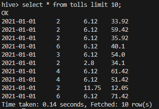

## Practica HIVE

### 1.En Hive, crear las siguientes tablas (internas) en la base de datos tripdata_bde en hive: 

* Creamos la base de datos tripdata_bde

* a. payments(VendorID, tpep_pickup_datetetime, payment_type, total_amount)
~~~
-- Creamos la tabla payments
CREATE TABLE payments (
    VendorID int, 
    tpep_pickup_datetetime date, 
    payment_type int, 
    total_amount double)
ROW FORMAT DELIMITED
FIELDS TERMINATED BY ',';
~~~

* b. passengers(tpep_pickup_datetetime, passenger_count, total_amount)
~~~
-- Creamos la tabla passengers
CREATE TABLE passengers (
    tpep_pickup_datetetime date, 
    passenger_count int, 
    total_amount double)
ROW FORMAT DELIMITED
FIELDS TERMINATED BY ',';
~~~

* c. tolls (tpep_pickup_datetetime, passenger_count, tolls_amount, total_amount)
~~~
-- Creamos la tabla tolls
CREATE TABLE tolls (
    tpep_pickup_datetetime date, 
    passenger_count int,
    tolls_amount double, 
    total_amount double)
ROW FORMAT DELIMITED
FIELDS TERMINATED BY ',';
~~~

* d. congestion (tpep_pickup_datetetime, passenger_count, congestion_surcharge,total_amount)
~~~
-- Creamos la tabla congestion
CREATE TABLE congestion (
    tpep_pickup_datetetime date, 
    passenger_count int,
    congestion_surcharge double,
    total_amount double)
ROW FORMAT DELIMITED
FIELDS TERMINATED BY ',';
~~~

* e. distance (tpep_pickup_datetetime, passenger_count, trip_distance,total_amount)
~~~
-- Creamos la tabla distance
CREATE TABLE distance (
    tpep_pickup_datetetime date, 
    passenger_count int,
    trip_distance double, 
    total_amount double)
ROW FORMAT DELIMITED
FIELDS TERMINATED BY ',';
~~~

### 2. En Hive, hacer un ‘describe’ de las tablas passengers y distance.
~~~
describe formatted passengers;
~~~

~~~
describe formatted distance;
~~~

### 3. Hacer ingest del file: Yellow_tripodata_2021-01.csv

* Para los siguientes ejercicios, debes usar PySpark (obligatorio). Si deseas practicar más, también puedes repetir los mismos en SQL (opcional)

### 4. (Opcional SQL) Generar una vista

 * Creamos un df a partir de la ingesta del archivo yellow_tripdata_2021-01.csv 
~~~
df = spark.read.option("header", "true").csv("/ingest/yellow_tripdata_2021-01.csv")
~~~

### 5. Insertar en la tabla payments (VendorID, tpep_pickup_datetetime, payment_type, total_amount) Solamente los pagos con tarjeta de crédito

* Casteamos los tipo de datos
~~~
df_cast = df.select(df.VendorID.cast("int"), df.tpep_pickup_datetime.cast("date"), df.payment_type.cast("int"), df.total_amount.cast("double"))
~~~

* Creamos un df de filtro para los datos que se deben de cargar. **Solamente los pagos con tarjeta de crédito**
~~~
df_filter = df_cast.filter(df_cast.payment_type == 4) 
~~~

* Generamos el **LOAD** para los datos.
~~~
df_filter.write.insertInto("tripdata_bde.payments")
~~~

* Se cargaron 5667 registros.

### 6. Insertar en la tabla passengers (tpep_pickup_datetetime, passenger_count,total_amount) los registros cuya cantidad de pasajeros sea mayor a 2 y el total del viaje cueste más de 8 dólares.

* Se realiza el mismo procedimiento.
* Creamos un df de casteo para los tipos de datos del archivo yellow_tripdata_2021-01.csv

~~~
df_cast = df.select(df.tpep_pickup_datetime.cast("date"), df.passenger_count.cast("int"), df.total_amount.cast("double"))
~~~

* Creamos un df de filtro para los datos que se deben de cargar 
~~~
df_filter = df_cast.filter((df_cast.passenger_count > 2) & (df_cast.total_amount > 8)) 
~~~

* Load de datos
~~~
df_filter.write.insertInto("tripdata_bde.passengers")
~~~

### 7. Insertar en la tabla tolls (tpep_pickup_datetetime, passenger_count, tolls_amount, total_amount) los registros que tengan pago de peajes mayores a 0.1 y cantidad de pasajeros mayores a 1.

* Se realiza el mismo procedimiento.

* Creamos un df de casteo para los tipos de datos del archivo yellow_tripdata_2021-01.csv
~~~
df_cast = df.select(df.tpep_pickup_datetime.cast("date"), df.passenger_count.cast("int"),df.tolls_amount.cast("double") ,df.total_amount.cast("double"))
~~~

* Creamos un df de filtro para los datos que se deben de cargar 
~~~
df_filter = df_cast.filter((df_cast.tolls_amount > 0.1) & (df_cast.passenger_count > 1)) 
~~~

* Load de datos
~~~
df_filter.write.insertInto("tripdata_bde.tolls")
~~~

### 8. Insertar en la tabla congestion (tpep_pickup_datetetime, passenger_count, congestion_surcharge, total_amount) los registros que hayan tenido congestión en los viajes en la fecha 2021-01-18

* Se realiza el mismo procedimiento.

* Creamos un df de casteo para los tipos de datos del archivo yellow_tripdata_2021-01.csv
~~~
df_cast = df.select(df.tpep_pickup_datetime.cast("date"), df.passenger_count.cast("int"), df.congestion_surcharge.cast("double") ,df.total_amount.cast("double"))
~~~

* Creamos un df de filtro para los datos que se deben de cargar 
~~~
df_filter = df_cast.filter((df_cast.tpep_pickup_datetime == '2021-01-18') & (df.congestion_surcharge > 0)) 
~~~

* Load de datos
~~~
df_filter.write.insertInto("tripdata_bde.congestion")
~~~

### 9. Insertar en la tabla distance (tpep_pickup_datetetime, passenger_count, trip_distance, total_amount) los registros de la fecha 2020-12-31 que hayan tenido solamente un pasajero (passenger_count = 1) y hayan recorrido más de 15 millas (trip_distance).

* Se realiza el mismo procedimiento.

* Creamos un df de casteo para los tipos de datos del archivo yellow_tripdata_2021-01.csv
~~~
df_cast = df.select(df.tpep_pickup_datetime.cast("date"), df.passenger_count.cast("int"), df.trip_distance.cast("double") ,df.total_amount.cast("double"))
~~~

* Creamos un df de filtro para los datos que se deben de cargar 
~~~
df_filter = df_cast.filter((df_cast.tpep_pickup_datetime == '2020-12-31') & (df.passenger_count == 1) & (df.trip_distance > 15)) 
~~~

* Load de datos
~~~
df_filter.write.insertInto("tripdata_bde.distance")
~~~

