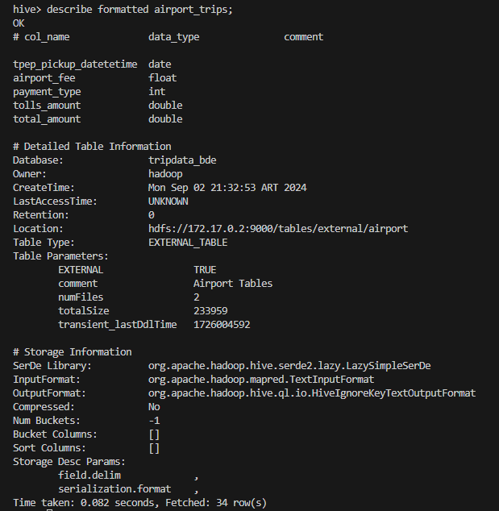
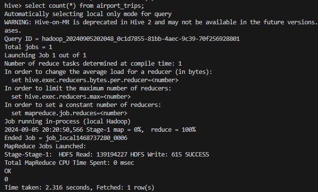
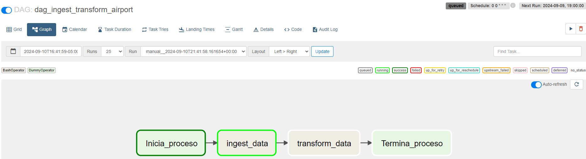
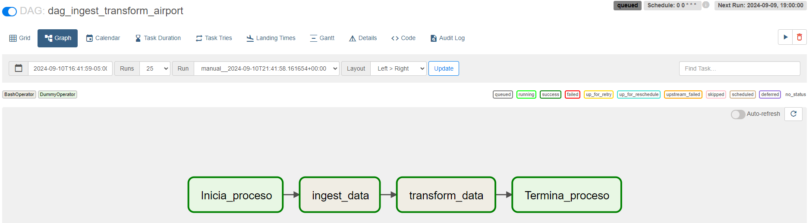
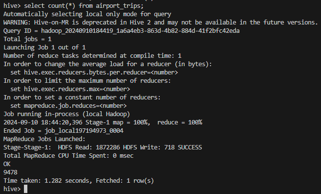
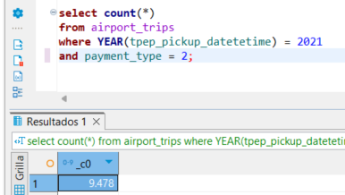

# Practica AIRFLOW

### 1 . En Hive, crear la siguiente tabla (externa) en la base de datos tripdata: a. airport_trips(tpep_pickup_datetetime, airport_fee, payment_type, tolls_amount,total_amount)

~~~
CREATE EXTERNAL TABLE airport_trips (
    tpep_pickup_datetetime date,
    airport_fee float, 
    payment_type int, 
    tolls_amount double,
    total_amount double)
COMMENT 'Airport Tables'
ROW FORMAT DELIMITED
FIELDS TERMINATED BY ','
LOCATION '/tables/external/airport';
~~~

### 2 . En Hive, mostrar el esquema de airport_trips

### 3. Crear un archivo .bash que permita descargar los archivos mencionados abajo e ingestarlos en HDFS:

~~~
ingest_to_hdfs_c7.sh
~~~

* Yellow_tripdata_2021-01.parquet
~~~
https://dataengineerpublic.blob.core.windows.net/data-engineer/yellow_tripdata_2021-01.parquet
~~~

* Yellow_tripdata_2021-02.parquet
~~~
https://dataengineerpublic.blob.core.windows.net/data-engineer/yellow_tripdata_2021-02.parquet
~~~

* Se descargan los archivos correctamente y se ingestan a HDFS.

### 4. Crear un archivo .py que permita, mediante Spark, crear un data frame uniendo los viajes del mes 01 y mes 02 del año 2021 y luego Insertar en la tabla airport_trips los viajes que tuvieron como inicio o destino aeropuertos, que hayan pagado con dinero.

~~~
script_spark_sql.py
~~~

### 5. Realizar un proceso automático en Airflow que orqueste los archivos creados en los puntos 3 y 4. Correrlo y mostrar una captura de pantalla (del DAG y del resultado en la base de datos)

~~~
dag_ingest_transform_airport.py
~~~

* Validamos que no exista informacion en el DWH HIVE

* Activamos el DAG para que realice el proceso de manera automática desde AIRFLOW

* Concluye el DAG de manera exitosa.

* Validamos que la información se encuentre cargada en HIVE.

