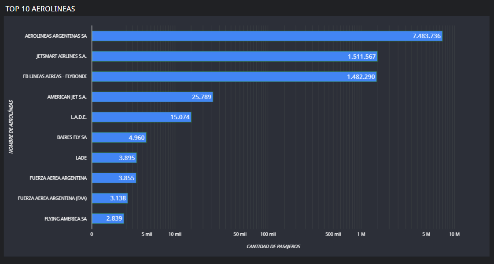

# Examen Final BDE 2024 - Marcos Castañeda
## Ejercicio 1 : Aviación Civil

### 1 . Hacer ingest de los siguientes files relacionados con transporte aéreo de Argentina.

* 2021: https://dataengineerpublic.blob.core.windows.net/data-engineer/2021-informe-ministerio.csv
* 2022: https://dataengineerpublic.blob.core.windows.net/data-engineer/202206-informe-ministerio.csv
* Aeropuertos_detalles: https://dataengineerpublic.blob.core.windows.net/data-engineer/aeropuertos_detalle.csv

Creamos un archivo .bash que permita descargar los archivos mencionados e ingestarlos en HDFS:

~~~
ingest_to_hdfs_anac.sh
~~~

Validamos la descarga e ingesta de los archivos indicados.

Creamos en HIVE una database **anac_db**:

~~~
create database anac_db;
~~~

### 2. Crear 2 tablas en el datawarehouse, una para los vuelos realizados en 2021 y 2022 (2021-informe-ministerio.csv y 202206-informe-ministerio) y otra tabla para el detalle de los aeropuertos (aeropuertos_detalle.csv)

~~~
script_hive_anac.hql
~~~

~~~
-- Creamos la base de datos anac_db
CREATE DATABASE anac_db;

-- Creamos la tabla flights
CREATE EXTERNAL TABLE flights (
    fecha date,
    horaUTC string, 
    clase_de_vuelo string, 
    clasificacion_de_vuelo string,
    tipo_de_movimiento string,
    aeropuerto string,
    origen_destino string,
    aerolinea_nombre string,
    aeronave string,
    pasajeros int)
COMMENT 'Flights Tables'
ROW FORMAT DELIMITED
FIELDS TERMINATED BY ','
LOCATION '/tables/external/anac/flights';

-- Creamos la tabla airport_details
CREATE EXTERNAL TABLE airport_details (
    aeropuerto  string, 
    oac string, 
    iata string, 
    tipo string, 
    denominacion string, 
    coordenadas string, 
    latitud string, 
    longitud string,
    elev float, 
    uom_elev string,
    ref string,
    distancia_ref float,
    direccion_ref string,
    condicion string,
    control string,
    region string,
    uso string,
    trafico string,
    sna string,
    concesionado string,
    provincia string)     
COMMENT 'Airport details Tables'
ROW FORMAT DELIMITED
FIELDS TERMINATED BY ','
LOCATION '/tables/external/anac/airport_details';

~~~

**NOTA : Colocar una carpeta individual para cada tabla.**

### Realizar un proceso automático orquestado por airflow que ingeste los archivos previamente mencionados entre las fechas 01/01/2021 y 30/06/2022 en las dos tablas creadas. 
* Los archivos 202206-informe-ministerio.csv y 202206-informe-ministerio.csv → en la
tabla aeropuerto_tabla
* El archivo aeropuertos_detalle.csv → en la tabla aeropuerto_detalles_tabla

~~~
dag_ingest_transform_anac.py
~~~

### 4. Realizar las siguiente transformaciones en los pipelines de datos:
* Eliminar la columna inhab ya que no se utilizará para el análisis.
* Eliminar la columna fir ya que no se utilizará para el análisis.
* En el campo distancia_ref si se encuentran campos en Null convertirlos en 0 (cero)

* Eliminar la columna “calidad del dato” ya que no se utilizará para el análisis.
* En el campo pasajeros si se encuentran campos en Null convertirlos en 0 (cero).

* Filtrar los vuelos internacionales ya que solamente se analizarán los vuelos
domésticos

### 5. Mostrar mediante una impresión de pantalla, que los tipos de campos de las tablas sean los solicitados en el datawarehouse (ej: fecha date, aeronave string, pasajeros integer, etc.)

### 6. Determinar la cantidad de vuelos entre las fechas 01/12/2021 y 31/01/2022. 

~~~
select count(*) 
from flights 
where fecha between DATE('2021-12-01') and DATE('2022-01-31');
~~~

### 7. Cantidad de pasajeros que viajaron en Aerolíneas Argentinas entre el 01/01/2021 y 30/06/2022. 

~~~
select sum(pasajeros) 
from flights 
where aerolinea_nombre  = 'AEROLINEAS ARGENTINAS SA'
and fecha between DATE('2021-01-01') and DATE('2022-06-30');
~~~

### 8. Mostrar fecha, hora, código aeropuerto salida, ciudad de salida, código de aeropuerto de arribo, ciudad de arribo, y cantidad de pasajeros de cada vuelo, entre el 01/01/2022 y el 30/06/2022 ordenados por fecha de manera descendiente.

~~~
select 
f.fecha,
f.horautc as hora,
f.aeropuerto as codigo_aeropuerto_salida,
ad_salida.ref  as ciudad_de_salida,
f.origen_destino as codigo_aeropuerto_arribo,
ad_arribo.ref as ciudad_de_arribo,
f.pasajeros as cantidad_pasajeros
from flights f
inner join airport_details ad_salida on (f.aeropuerto = ad_salida.aeropuerto)
inner join airport_details ad_arribo on (f.origen_destino = ad_arribo.aeropuerto)
where f.fecha between DATE('2022-01-01') and DATE('2022-06-30')
order by f.fecha desc;
~~~

### 9. Cuales son las 10 aerolíneas que más pasajeros llevaron entre el 01/01/2021 y el 30/06/2022 exceptuando aquellas aerolíneas que no tengan nombre. Mostrar consulta y Visualización

~~~
SELECT  
f.aerolinea_nombre,
sum(pasajeros) as pasajeros
FROM airport_details ad 
inner join flights f on (ad.aeropuerto = f.aeropuerto)
where f.fecha between DATE('2021-01-01') and DATE('2022-06-30')
and f.aerolinea_nombre <> '0' 
group by f.aerolinea_nombre
order by pasajeros desc
limit 10;
~~~

### 10. Cuales son las 10 aeronaves más utilizadas entre el 01/01/2021 y el 30/06/22 que despegaron desde la Ciudad autónoma de Buenos Aires o de Buenos Aires, exceptuando aquellas aeronaves que no cuentan con nombre. Mostrar consulta y Visualización

~~~
SELECT  
f.aeronave,
count(f.pasajeros) as total_vuelos
FROM flights f
inner join airport_details ad on (f.aeropuerto = ad.aeropuerto)
where f.fecha between DATE('2021-01-01') and DATE('2022-06-30')
and (ad.provincia = 'CIUDAD AUTONOMA DE BUENOS AIRES' or ad.provincia = 'BUENOS AIRES')  
and f.aeronave <> '0'
group by f.aeronave
order by total_vuelos desc
limit 10;
~~~

### 11. Qué datos externos agregaría en este dataset que mejoraría el análisis de los datos 

* Todos los años desde que inicio operación el aeropuerto internacional de Argentina.
* Agregar los vuelos internacionales.
* Complementar todos los valores NULL.

### 12. Elabore sus conclusiones y recomendaciones sobre este proyecto.

* **Calidad de los Datos**: A lo largo del proyecto se identicaron varios problemas con la calidad de los datos:
    * Valores Nulos
    * Campos Vacios
    * Duplicados

    **Estos incovenientes fueron tratados de manera efectiva mediante transformaciones y limpieza en Spark, asegurando que los datos finales fueran confiables para el análisis**

* **Eficiencia en el proceso de ETL**: El proceso de extracción, transformación y carga (ETL) se diseño para ser eficiente.
    
* **Integración de Múltiples fuentes**: Se integraron varias fuentes de datos, como informes ministeriales y datos de aeropuertos, lo cual permitió una visión más completa del tráfico aéreo duranta el período analizado.

* **Análisis de Tendencia**: Los análisis realizados, como las aerolíneas y aeronaves más utilizadas, proporcionarón insights valiosos para identificar patrones en el comportamiento de los vuelos.

### 13. Proponer una arquitectura alternativa para este proceso ya sea con herramientas on premise o cloud (Sí aplica).

