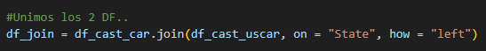
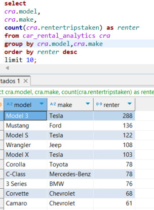
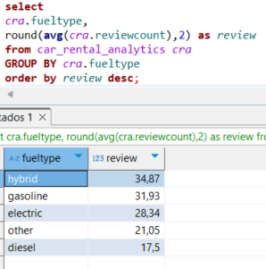

# Examen Final BDE 2024 - Marcos Castañeda
## Ejercicio 2 : Car Rental

### 1. Crear en hive una database car_rental_db y dentro una tabla llamada car_rental_analytics.

* Creamos una DB en HIVE **car_rental_db**

~~~
CREATE DATABASE car_rental_db;
~~~

* Creamos la tabla **car_rental_analytics**

~~~
script_hive_car.hql
~~~

~~~
CREATE EXTERNAL TABLE car_rental_analytics, (
    fuelType string,
    rating int, 
    renterTripsTaken int, 
    reviewCount int,
    city string,
    state_name string,
    owner_id int,
    rate_daily int,
    make string,
    model string.
    year int)
COMMENT 'Car_Rental Tables'
ROW FORMAT DELIMITED
FIELDS TERMINATED BY ','
LOCATION '/tables/external/car_rental/car_rental_analytics';
~~~

### 2. Crear script para el ingest de estos dos files

* https://dataengineerpublic.blob.core.windows.net/data-engineer/CarRentalData.csv
* https://dataengineerpublic.blob.core.windows.net/data-engineer/georef-united-states-of-america-state.csv
* Info del dataset: https://www.kaggle.com/datasets/kushleshkumar/cornell-car-rental-dataset

### 3. Crear un script para tomar el archivo desde HDFS y realizar las siguientes transformaciones:
~~~
transform_spark_sql_car.py
~~~

* En donde sea necesario, modificar los nombres de las columnas. Evitar espacios
y puntos (reemplazar por _ ). Evitar nombres de columna largos

* Redondear los float de ‘rating’ y castear a int.

* Joinear ambos files

* Eliminar los registros con rating nulo
* Cambiar mayúsculas por minúsculas en ‘fuelType’
* Excluir el estado Texas

### 4. Realizar un proceso automático en Airflow que orqueste los pipelines creados en los puntos anteriores. Crear dos tareas: 

~~~
dag_ingets_car_p.py
~~~

* a. Un DAG padre que ingente los archivos y luego llame al DAG hijo 

~~~
dag_transform_car_h.py
~~~

* b. Un DAG hijo que procese la información y la cargue en Hive

### 5. Por medio de consultas SQL al data-warehouse, mostrar: 

* a. Cantidad de alquileres de autos, teniendo en cuenta sólo los vehículos
ecológicos (fuelType hibrido o eléctrico) y con un rating de al menos 4.
~~~
select count(*)
from car_rental_analytics cra
where fueltype = 'hybrid' or fueltype = 'electric'
and rating >= 4;
~~~

* b. los 5 estados con menor cantidad de alquileres (mostrar query y visualización)
~~~
select cra.state_name,
sum(cra.rentertripstaken) as renter
from car_rental_analytics cra 
group by cra.state_name
order by renter asc
limit 5;
~~~

* c. los 10 modelos (junto con su marca) de autos más rentados (mostrar query y
visualización)
~~~
select 
cra.model,
cra.make,
count(cra.rentertripstaken) as renter
from car_rental_analytics cra 
group by cra.model,cra.make
order by renter desc
limit 10;
~~~

* d. Mostrar por año, cuántos alquileres se hicieron, teniendo en cuenta automóviles
fabricados desde 2010 a 2015
~~~
select 
cra.`year`,
count(cra.rentertripstaken) as renter
from car_rental_analytics cra 
where cra.year BETWEEN (2010) and (2015)
group by cra.`year` ;
~~~

* e. las 5 ciudades con más alquileres de vehículos ecológicos (fuelType hibrido o
electrico)
~~~
select cra.city ,
count(cra.rentertripstaken) as renter
from car_rental_analytics cra 
where cra.fueltype = 'hybrid' or cra.fueltype = 'electric'
group by cra.city
order by renter desc
limit 5;
~~~

* f. el promedio de reviews, segmentando por tipo de combustible
~~~
select 
cra.fueltype,
round(avg(cra.reviewcount),2) as review 
from car_rental_analytics cra 
GROUP BY cra.fueltype
order by review desc;
~~~

### 6. Elabore sus conclusiones y recomendaciones sobre este proyecto.

* **Calidad de los Datos**: A lo largo del proyecto se identicaron varios problemas con la calidad de los datos:
    * Valores Nulos
    * Campos Vacios
    * Campos sin ninguna descripción 
    
    **Estos incovenientes fueron tratados de manera efectiva mediante transformaciones y limpieza en Spark, asegurando que los datos finales fueran confiables para el análisis**

* **Eficiencia en el proceso de ETL**: El proceso de extracción, transformación y carga (ETL) se diseño para ser eficiente con dependencia (Padre - Hijo).
    
* **Análisis de Tendencia**: Los análisis realizados, como las autos y tipo de combustible más rentados, proporcionarón insights valiosos para identificar patrones en el comportamiento de la renta de los autos, dando como mérito el impacto que tiene la tendencia ESG a nivel mundial.

### 7. Proponer una arquitectura alternativa para este proceso ya sea con herramientas on premise o cloud (Si aplica)

