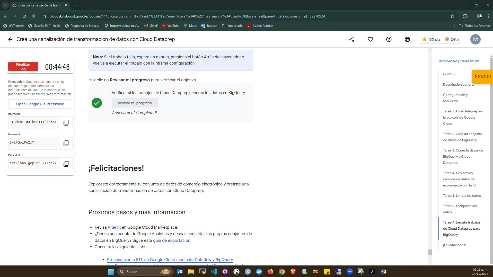
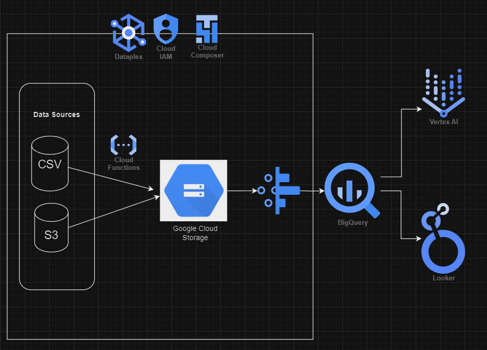

# Examen Final BDE 2024 - Marcos Castañeda
## Ejercicio 3 : Data Prep

### 1. ¿Para que se utiliza data prep?
* Se utiliza para explorar, limpiar y preparar visualmente los datos estructurados y no estructurados para su análisis.

### 2. ¿Qué cosas se pueden realizar con DataPrep?
* Conectar conjuntos de datos.
* Explorar la calidad de los conjuntos de datos.
* Unir varios conjuntos de datos.
* Crear secuencias de transformacion sobre un Dataset
* Transformación de datos.

### 3. ¿Por qué otra/s herramientas lo podrías reemplazar? Por qué?
* Spark, Dataproc.
* Por que en cada una de estas, ya realizar las transformaciones de nivel gráfico para la inetracción con el usuario, sin la necesidad de saber algun lenguaje de programación.

### 4. ¿Cuáles son los casos de uso comunes de Data Prep de GCP?
* Importación, Exploración y Análisis para despues pasarlo a Big Query y consumir la información.

### 5. ¿Cómo se cargan los datos en Data Prep de GCP?
* A traves de flows definidos por el usuario.

### 6. ¿Qué tipos de datos se pueden preparar en Data Prep de GCP?
* Todos los tipos de datos, incluyendo tipos Object, Array, etc.

### 7. ¿Qué pasos se pueden seguir para limpiar y transformar datos en Data Prep de GCP?
* 1. Explorar los campos de datos
* 2. Validar los números de columnas
* 3. Validar los valores que coindicen de cada campo
* 4. Definir las categorias más populares
* 5. Eliminar columnas obsoletas o duplicadas.
* 6. Limpiar los datos.
* 7. Convertir los tipos de datos de cada columna correspondiente.
* 8. Eliminar duplicidad de filas.
* 10. Enriquecer los datos.  

### 8. ¿Cómo se pueden automatizar tareas de preparación de datos en Data Prep de GCP?
* Creando un flujo de trabajo
* Programar el flujo de trabajo
* Ejecución y monitoreo 
* Notificaciones sobre alguna tarea cuando se complete o falle.

### 9. ¿Qué tipos de visualizaciones se pueden crear en Data Prep de GCP?
* Histogramas y gráficas de barras, entre otras dependiendo el enfoque del análisis.

### 10. ¿Cómo se puede garantizar la calidad de los datos en Data Prep de GCP?
* Durante el proceso de preparación, puedes usar las visualizaciones de Dataprep para monitorear la calidad de los datos.

### Conclusión de Laboratorio

### Arquitectura:
 * El gerente de Analitca te pide realizar una arquitectura hecha en GCP que contemple el uso deesta herramienta ya que le parece muy fácil de usar y una interfaz visual que ayuda a sus desarrolladores ya que no necesitan conocer ningún lenguaje de desarrollo.

* Esta arquitectura debería contemplar las siguiente etapas:
* **Ingesta**: datos parquet almacenados en un bucket de S3 y datos de una aplicación que guarda sus datos en Cloud SQL.
* **Procesamiento**: filtrar, limpiar y procesar datos provenientes de estas fuentes
* **Almacenar**: almacenar los datos procesados en BigQuery
* **BI**: herramientas para visualizar la información almacenada en el Data Warehouse
* **ML**: Herramienta para construir un modelo de regresión lineal con la información almacenada en el Data Warehouse.

